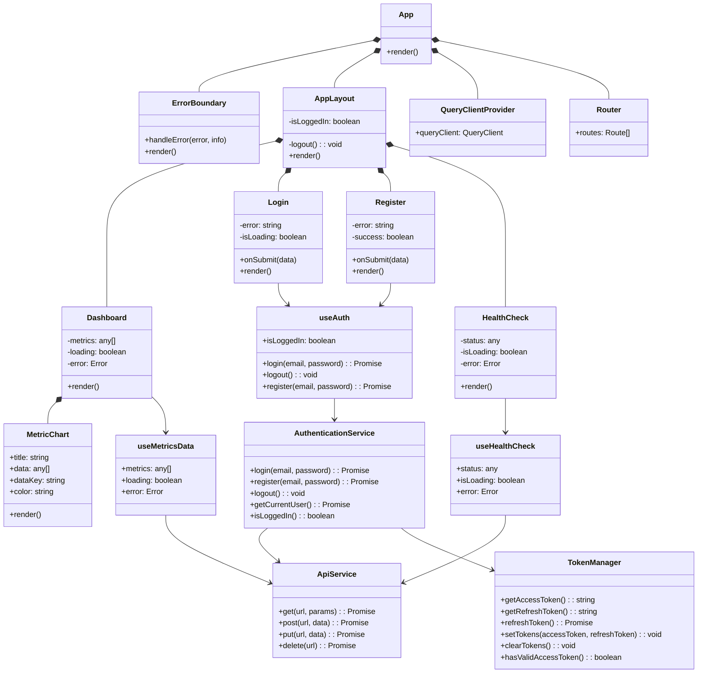

# Team Health Dashboard Client

This project is a React Typescript Client that consumes the Endpoints available through the backend of Team Health Dashboard.

## Commits

Excerpt from <https://www.conventionalcommits.org/en/v1.0.0/#summary>:

The commit message should be structured as follows:

```txt
<type>[optional scope]: <description>

[optional body]

[optional footer(s)]
```

The commit contains the following structural elements, to communicate intent to the consumers of your library:

`fix:` a commit of the type fix patches a bug in your codebase (this correlates with PATCH in Semantic Versioning).

`feat:` a commit of the type feat introduces a new feature to the codebase (this correlates with MINOR in Semantic Versioning).

`BREAKING CHANGE:` a commit that has a footer BREAKING CHANGE:, or appends a ! after the type/scope, introduces a breaking API change (correlating with MAJOR in Semantic Versioning). A BREAKING CHANGE can be part of commits of any type.

Types other than `fix:` and `feat:` are allowed, for example `@commitlint/config-conventional` (based on the Angular convention) recommends `build:`, `chore:`, `ci:`, `docs:`, `style:`, `refactor:`, `perf:`, `test:`, and others.

Footers other than `BREAKING CHANGE: <description>` may be provided and follow a convention similar to git trailer format.

Additional types are not mandated by the Conventional Commits specification, and have no implicit effect in Semantic Versioning (unless they include a BREAKING CHANGE). A scope may be provided to a commit’s type, to provide additional contextual information and is contained within parenthesis, e.g., `feat(parser):` add ability to parse arrays.

This template provides a minimal setup to get React working in Vite with HMR and some ESLint rules.

## Architecture


